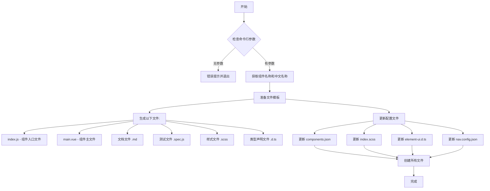

# Element UI 学习笔记

## 参考资料
- [Element UI 源码解析](https://juejin.cn/post/7031331765482422280#heading-9)

## 新知识要点
1. [Process 对象](https://javascript.ruanyifeng.com/nodejs/process.html#toc1)
   
2. 重要开源项目
   - [`file-save`](https://npm.im/file-save)

## 拓展学习
Element UI 搜索功能实现:
- 文件路径: `\element\examples\components\search.vue`
- 搜索功能基于 `algoliasearch` 开源库实现 | 待深入研究

## 流程图 | element-ui 创建新组件

