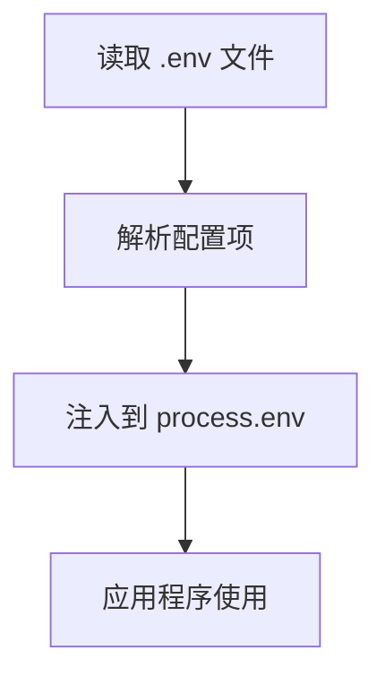

# .env 文件实现原理解析

## 目录
- [.env 文件实现原理解析](#env-文件实现原理解析)
  - [目录](#目录)
  - [什么是 .env](#什么是-env)
  - [实现原理](#实现原理)
  - [源码实现](#源码实现)
    - [基础版本实现](#基础版本实现)
    - [进阶功能](#进阶功能)
  - [最佳实践](#最佳实践)
  - [注意事项](#注意事项)
    - [行尾问题详解](#行尾问题详解)
    - [变量展开详解](#变量展开详解)

## 什么是 .env

.env 文件是一个用于存储环境变量的配置文件，通常用于：
- 存储敏感信息（数据库密码、API密钥等）
- 区分不同环境的配置（开发、测试、生产）
- 避免硬编码配置信息

基本格式：
```bash
DB_HOST=localhost
DB_USER=root
DB_PASS=123456
API_KEY=abcdef123456
```

## 实现原理



主要步骤：
1. 读取 .env 文件内容
2. 解析每一行配置
3. 将配置注入到 process.env 对象
4. 应用程序通过 process.env 访问配置

## 源码实现

### 基础版本实现

```typescript
const fs = require('fs')
const path = require('path')

function parse(src) {
  // 初始化结果对象
  const result = {}
  
  // 按行分割
  const lines = src.toString().split('\n')
  
  // 解析每一行
  for (const line of lines) {
    // 跳过空行和注释
    if (!line || line.startsWith('#')) continue
    
    // 分割键值对
    const keyValueArr = line.split('=')
    const key = keyValueArr[0]
    const value = keyValueArr[1]
    
    // 存入结果对象
    result[key] = value
  }
  
  return result
}

function config(options = {}) {
  // 获取 .env 文件路径
  const envPath = path.resolve(process.cwd(), '.env')
  
  try {
    // 读取文件内容
    const content = fs.readFileSync(envPath, 'utf-8')
    
    // 解析配置
    const parsed = parse(content)
    
    // 注入到 process.env
    for (const key in parsed) {
      if (!process.env[key]) {
        process.env[key] = parsed[key]
      }
    }
    
    return { parsed }
  } catch (err) {
    return { error: err }
  }
}
```

### 进阶功能

```typescript
// ... 前面的代码省略 ...

function parse(src) {
  const result = {}
  
  // 支持多行值
  const lines = src.toString().split('\n')
  let multiline = false
  let key = ''
  let value = ''
  
  for (const line of lines) {
    if (multiline) {
      // 处理多行值
      if (line.endsWith('"')) {
        multiline = false
        value += line.slice(0, -1)
        result[key] = value
        value = ''
      } else {
        value += line + '\n'
      }
    } else {
      // 普通行处理
      if (line.startsWith('#')) continue
      
      const match = line.match(/^([^=]+)=(.*)$/)
      if (!match) continue
      
      key = match[1].trim()
      value = match[2].trim()
      
      // 检查是否多行值开始
      if (value.startsWith('"') && !value.endsWith('"')) {
        multiline = true
        value = value.slice(1) + '\n'
        continue
      }
      
      result[key] = value
    }
  }
  
  return result
}
```

## 最佳实践

1. 文件命名规范
```bash
.env                # 默认环境变量
.env.development    # 开发环境
.env.test          # 测试环境
.env.production     # 生产环境
```

2. 配置项命名规范
```bash
# 推荐使用大写字母和下划线
REACT_APP_API_URL=https://api.example.com
VUE_APP_TITLE=My App

# 避免使用特殊字符
# 避免使用空格
```

3. 安全建议
- 将 .env 文件添加到 .gitignore
- 提供 .env.example 作为模板
- 敏感信息使用加密存储
- 生产环境使用环境变量注入

## 注意事项

1. 变量覆盖规则

在使用 `.env` 文件时，可能会遇到多个文件定义相同的环境变量的情况。为了确保变量的正确性和优先级，通常会遵循以下覆盖规则：


1. **系统环境变量**：优先级最高，通常在操作系统级别设置，或通过命令行传递给应用程序。
2. **.env 文件变量**：在没有系统环境变量的情况下，使用 `.env` 文件中定义的变量。
3. **.env.local 变量**：用于本地开发环境，覆盖 `.env` 文件中的变量。
4. **.env.development 变量**：用于开发环境，覆盖 `.env` 和 `.env.local` 中的变量。

这种覆盖规则允许开发者在不同的环境中灵活地配置和管理环境变量，确保应用程序在开发、测试和生产环境中都能正常运行。
2. 常见问题
- 编码问题（推荐使用 UTF-8）
- 行尾问题（处理 CRLF/LF）
- 引号处理（支持单引号和双引号）
- 变量展开（是否支持 ${VAR} 语法）

### 行尾问题详解

在不同的操作系统中，文本文件的行尾符号可能不同：

- **Windows** 使用 `CRLF` (`\r\n`)
- **Unix/Linux** 使用 `LF` (`\n`) 
- **Mac（旧版）** 使用 `CR` (`\r`)

在解析 `.env` 文件时，行尾符号的不同可能导致解析错误或不一致的行为。因此，建议在处理 `.env` 文件时：

1. **统一行尾符号**：在读取文件时，可以使用正则表达式或字符串替换将所有行尾符号统一为 `LF`。
2. **使用 UTF-8 编码**：确保文件使用 UTF-8 编码，以避免字符编码问题。

### 变量展开详解

变量展开是指在 `.env` 文件中使用其他变量的值。例如：

```bash
BASE_URL=http://example.com
API_URL=${BASE_URL}/api
```

在这种情况下，`API_URL` 的值应该解析为 `http://example.com/api`。要实现变量展开，需要在解析 `.env` 文件时：

1. **检测变量引用**：在解析每一行时，检查值中是否包含 `${VAR}` 形式的变量引用。
2. **替换变量值**：如果检测到变量引用，查找对应的变量值并进行替换。
3. **处理递归引用**：确保处理递归引用的情况，避免无限循环。

实现变量展开的代码示例：

```typescript
function expandVariables(parsed) {
  const expanded = {}

  for (const key in parsed) {
    let value = parsed[key]
    const matches = value.match(/\${([^}]+)}/g)

    if (matches) {
      for (const match of matches) {
        const varName = match.slice(2, -1)
        const varValue = parsed[varName] || process.env[varName] || ''
        value = value.replace(match, varValue)
      }
    }

    expanded[key] = value
  }

  return expanded
}
```

在解析 `.env` 文件后，可以调用 `expandVariables` 函数来处理变量展开。